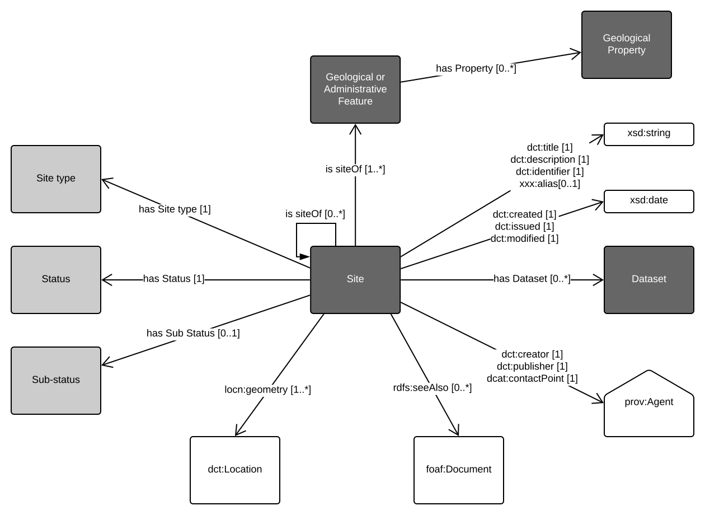
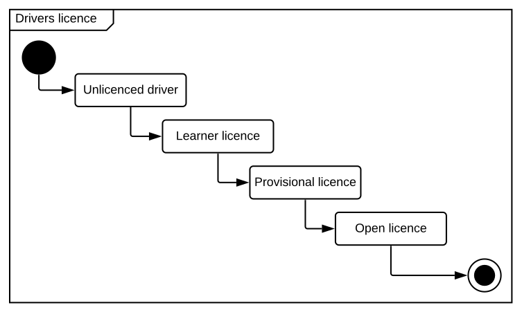

# GSQ Site Profile
This profile describes the ```site``` concept. 

GSQ uses ```site``` to describe a (typically) physical location. Examples of ```site``` are:
- where the sample was collected
- where the borehole was drilled
- where the seismic line was shot

<p align="center">
<br>
Figure 1: Site profile</p>

Figure 1. shows the template Site profile used by GSQ.


# Dataset Profile Usage (optional)
When conducting an exploration survey, it may not be possible to sample the entire geological or administrative feature in one sample. For instance, when collecting stream sediments along a water course, the operator conducting the survey collects samples at intervals metres apart. Each sample collection point is considered a site. 

Consider using an [activity diagram](https://www.lucidchart.com/pages/uml-activity-diagram), [state diagram](https://www.lucidchart.com/pages/uml-state-machine-diagram), or [sequence diagram](https://www.lucidchart.com/pages/uml-sequence-diagram) to explain process flows and temporal states.

<p align="center">
<br>
Figure 3: Add title of graphic</p>

## Profile Resources
This profile is presented as a series of files that perform different roles:

1. [model/](model/) - the *model* folder contains this profile's models in both graphical (SVG) and machine-readable, textual, form ( [RDF](https://www.w3.org/RDF/) turtle).
2. [shapes/](shapes/) - folder containing SHACL shapes files used to validate data's conformance to this profile's model.
3. [profile.ttl](profile.ttl) - the profile declaration. A description of all of the items in this profile (the formal model, validating resources, documentation etc.) according to the W3C's [Profiles Ontology](https://www.w3.org/TR/dx-prof/) which describes how all the parts related to one another, the roles they play (to give *guidance* for use, to *validate* data etc.) and how this profile *profiles* the various standards listed above.


## GSQ classes
> This section lists the GSQ classes that feature in the model. Use links to those classes. Delete the examples listed below as required.

Classes used in this profile:
1. GSQ Geological or Administrative Feature
2. GSQ Geological Property
3. [GSQ Dataset](https://github.com/geological-survey-of-queensland/gsq-dataset-profile)


## OWL classes
> This section lists the OWL classes (the internationally defined classes).  Delete the examples listed below as required.
1.[dct:title](https://w3c.github.io/dxwg/dcat/#Property:resource_title) - report title
2. [dct:description](https://w3c.github.io/dxwg/dcat/#Property:resource_description)
3. [dct:identifier](https://w3c.github.io/dxwg/dcat/#Property:resource_identifier) - report number 
4. xxx:alias
5. [dct:created](https://w3c.github.io/dxwg/dcat/)
6. [dct:issued](https://w3c.github.io/dxwg/dcat/#Property:resource_release_date) - date of formal issuance (e.g., open file publication)
7. [dct:modified](https://w3c.github.io/dxwg/dcat/#Property:resource_update_date) - most recent date on which the item was changed, updated or modified
8. [dct:creator](https://w3c.github.io/dxwg/dcat/#Property:resource_creator) - the author of the report
9. [dct:publisher](https://w3c.github.io/dxwg/dcat/#Property:resource_publisher) - GSQ
10. [dct:contactPoint](https://w3c.github.io/dxwg/dcat/#Property:resource_contact_point) - GSQ contact
11. [foaf:Agent](http://xmlns.com/foaf/spec/#term_Agent)
12. [rdfs:seeAlso](https://www.w3.org/TR/rdf-schema/#ch_seealso) - refers to secondary metadata
13. [FOAF document](http://xmlns.com/foaf/spec/#term_Document) - a document with secondary metadata
14. [dct:Location](https://w3c.github.io/dxwg/dcat/#Class:Location) - spatial coverage of the report expressed as lat/long, centroid, bounding box or simple polygon

### [Distribution](https://w3c.github.io/dxwg/dcat/#Class:Distribution) properties not shown in the diagram:
> No distribution properties for Site template

## Vocabularies
> List the vocabularies and link to them if published. Delete the examples listed below as required.

The vocabularies used in this profile are:
1. [GSQ Site type](https://vocabs.gsq.digital/vocabulary/site-detail-type)
2. [GSQ Status]()
3. [GSQ Sub-status]()


## Licence
The content of this repository is licensed for use with the [Creative Commons 4.0 License](https://creativecommons.org/licenses/by/4.0/). See the [license deed](LICENSE) for details.


## Contacts 
*owner*:  
**Mark Gordon**  
*Director - Geoscience Information*  
Geological Survey of Queensland  
<mark.gordon@dnrme.qld.gov.au>  

*author*:  
**Your Name**  
*Your Role Title - Your Unit*  
Geological Survey of Queensland  
<your.email@dnrme.qld.gov.au>

___
**Profile Status:** Draft
